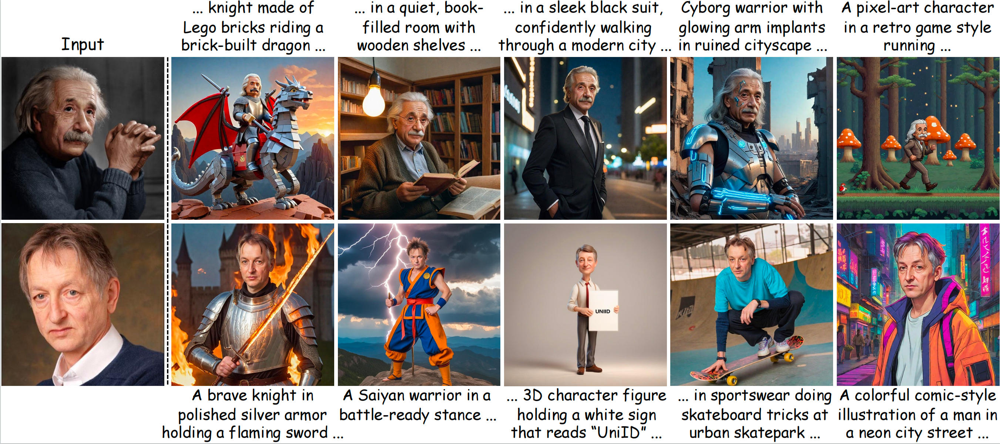

# Training for Identity, Inference for Controllability: A Unified Approach to Tuning-Free Face Personalization

Official Implementation of "Training for Identity, Inference for Controllability: A Unified Approach to Tuning-Free Face Personalization" by Lianyu Pang, Ji Zhou, Qiping Wang, Baoquan Zhao, Zhenguo Yang, Li Qing and Xudong Mao.

<a href="https://arxiv.org/abs/2512.03964"></a>



## Introduction
We introduce **UniID**, a unified tuning-free framework that synergistically combines text embedding and adapter approaches while preserving both identity fidelity and text controllability. Our key insight is that when merging the two branches, they should mutually reinforce only identity information, while non-identity aspects such as scene composition are controlled by the original diffusion model's prior knowledge. Specifically, during training, we employ an identity-focused learning scheme that guides both the text embedding and adapter branches to capture exclusively identity-relevant features. At inference, we introduce a normalized rescaling strategy that recovers the text controllability of the original diffusion model in both branches while enabling their complementary identity signals to mutually reinforce each other. Through this strategic training-inference paradigm, UniID achieves superior identity fidelity while preserving the text controllability of the original model.


## Release
- [x] 2025/12/04: We release the code!
- [ ] Release the model weight

## Setup
### Set up the Environment
To set up the environment, run the following commands:
```bash
conda env create -f environment.yaml
conda activate uniid
```
### Initialize Accelerate
Initialize an [Accelerate](https://github.com/huggingface/accelerate/) environment with:
```bash
accelerate config
```

## Download
### Image Dataset
We used [CelebA-HQ](https://mmlab.ie.cuhk.edu.hk/projects/CelebA/CelebAMask_HQ.html)'s training set, [FFHQ-Portrait](https://github.com/NVlabs/ffhq-dataset) and filtered [FaceID-6M](https://github.com/ShuheSH/FaceID-6M/tree/master) to train our model.

### Face Recognition model
We used [Partial-FC](https://github.com/deepinsight/insightface/blob/master/recognition/partial_fc) as our face recognition model.


## Usage

### Training

You can run the `bash_scripts/train_uniid.sh` script to train your own model. Before executing the training command, ensure that you have configured the following parameters in `train_uniid.sh`:
+ Line **3**: `pretrained_face_recog_model_path`. This is the path to the face recognition model.
+ Line **4**: `data_path_file`. This file contains the paths of all training data. For example:
    ```
    dataset/CelebA-HQ/train/00000.jpg
    dataset/CelebA-HQ/train/00001.jpg
    ...
    dataset/ffhq/train/00001.jpg
    ```
    You can generate this file using the function `write_dataset_to_file` in `utils.py`.
+ Line **5**: `output_root`. This is the directory where the trained model will be saved.

To run the training script:
```bash
bash bash_scripts/train_uniid.sh
```
**Notes**:
+ All training arguments can be found in `train_uniid.sh` and are set to their defaults according to the official paper.
+ Please refer to `train_uniid.sh` for more details on all parameters.

### Inference
You can run the `bash_scripts/inference.sh` script to generate images. Before executing the inference command, ensure that you have configured the following parameters in `inference.sh`:
+ Line **3**: `text_branch_checkpoint_dir`. This is the directory containing the checkpoints of the text branch.
+ Line **4**: `adapter_branch_checkpoint_dir`. This is the directory containing the checkpoints of the adapter branch.
+ Line **6**: `ref_image_path`. This is the path to the reference image.
+ Line **7**: `save_dir`. This is the directory where the generated images will be saved.
+ Line **9**: `prompt`. This is the input prompt. For convenience, you can either specify a path to a text file with `--prompt_file`, where each line contains a prompt. For example:
    ```
    A photo of a <class word>
    A <class word> eating bread in front of the Eiffel Tower
    A <class word> latte art
    ```

To run the inference script:
```bash
bash bash_scripts/inference.sh
```
+ The resulting images will be saved in the directory `{save_dir}/{prompt}`

+ For detailed information on all parameters, please consult `inference.py` and `inference.sh`.

## Acknowledgements
We would like to express our sincere gratitude to the creators and maintainers of [CelebA-HQ](https://mmlab.ie.cuhk.edu.hk/projects/CelebA/CelebAMask_HQ.html), [FFHQ-Portrait](https://github.com/NVlabs/ffhq-dataset), [FaceID-6M](https://github.com/ShuheSH/FaceID-6M/tree/master), [Diffusers](https://github.com/huggingface/diffusers/tree/main), [Celeb Basis](https://github.com/ygtxr1997/CelebBasis/tree/main) and [IP-Adapter](https://github.com/tencent-ailab/IP-Adapter). Our project would not exist without their foundational work and dedication to the open-source community.

## Reference
```
@article{UniID,
  title = {Training for Identity, Inference for Controllability: A Unified Approach to Tuning-Free Face Personalization},
  author = {Lianyu Pang, Ji Zhou, Qiping Wang, Baoquan Zhao, Zhenguo Yang, Qing Li, Xudong Mao},
  journal = {arXiv preprint arXiv:2512.03964},
  year = {2025}
}
```
